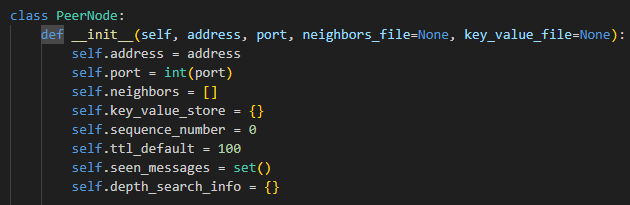
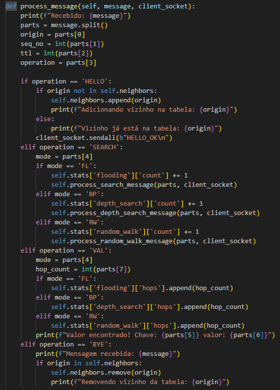
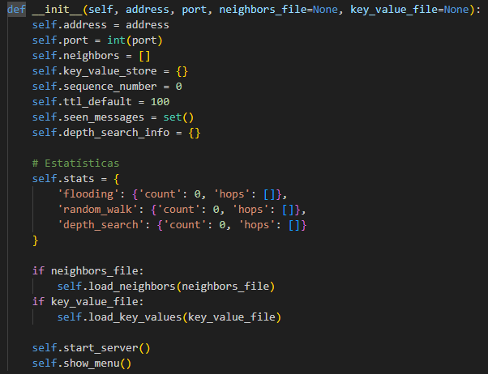
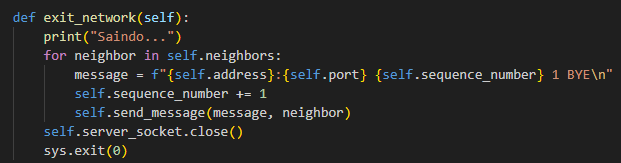
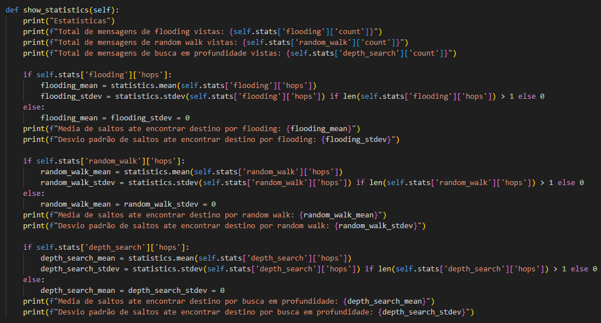
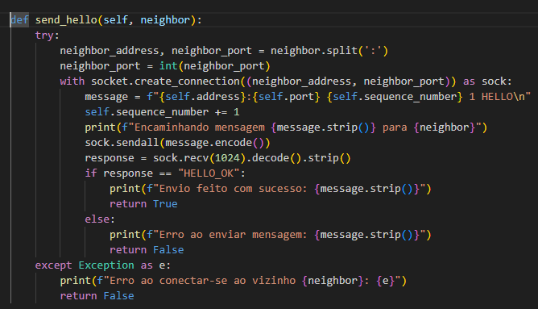
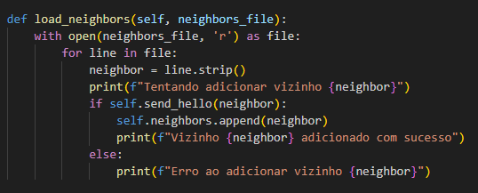

# Sistema de busca não estruturado p2p

## Detalhes de implementação

### Paradigma de Programação Escolhido
O paradigma de programação escolhido para a implementação da rede P2P não estruturada foi a programação orientada a objetos (POO), que permite organizar o código de maneira modular e reutilizável, encapsulando a lógica relacionada ao nó peer dentro de uma classe PeerNode. Isso facilita a manutenção e a expansão do código, pois cada instância da classe (objeto) representa um nó na rede P2P com seu próprio estado, comportamento e atributos.

### Divisão do Programa em Threads
A divisão do programa em threads foi realizada para permitir que cada nó peer pudesse simultaneamente aceitar conexões de novos clientes, processar mensagens recebidas e executar outras tarefas (como enviar mensagens ou realizar buscas). A implementação utilizou a biblioteca threading do Python para criar threads que tratam das seguintes responsabilidades:

- Thread do Servidor: Após a inicialização, o método start_server cria uma thread que executa o método accept_connections. Esta thread fica em um loop contínuo aguardando conexões de novos clientes e, ao aceitar uma conexão, cria uma nova thread para tratar a comunicação com o cliente.

- Thread de Cliente: Cada conexão aceita resulta na criação de uma thread dedicada para tratar a comunicação com o cliente, executando o método handle_client. Esta thread lê mensagens do cliente e invoca o método process_message para processar cada mensagem recebida.

Essa abordagem escolhida permite que múltiplas conexões sejam tratadas de forma simultânea, evitando bloqueios que impediriam o nó de responder rapidamente a novas conexões ou a mensagens recebidas.

### Operações Bloqueantes vs. Não Bloqueantes
A implementação optou por utilizar operações bloqueantes. Especificamente, as operações de socket (como accept, recv e sendall) são bloqueantes. Isso significa que uma chamada a essas funções fará com que a thread que as chamou aguarde até que a operação seja concluída.

O motivo da escolha pelas operações bloqueantes se deu por sua simplicidade e pela adequação ao objetivo do projeto. Como cada operação bloqueante é executada em sua própria thread, o uso de bloqueio não prejudica o desempenho geral do nó, permitindo que outras threads continuem executando suas tarefas. Além disso, o uso de threads simplifica o modelo de programação e evita a complexidade adicional de lidar com operações assíncronas ou não bloqueantes.

### Armazenamento de Dados
A classe PeerNode possui um dicionário key_value_store para armazenar pares chave-valor.
Os vizinhos são armazenados em uma lista neighbors.
Mensagens vistas são rastreadas em um conjunto seen_messages para evitar o processamento repetido.<br>


### Tratamento de Mensagens
Mensagens são processadas pelo método `process_message`, que analisa o tipo de operação (HELLO, SEARCH, VAL, BYE) e executa a ação apropriada. <br>
<br>
Mensagens de busca (SEARCH) podem ser de três tipos: flooding (FL), random walk (RW) e busca em profundidade (BP), cada uma com seu próprio método de processamento (process_search_message, process_random_walk_message, process_depth_search_message).

### Início e Término da Rede
Ao iniciar, cada nó lê os arquivos de vizinhos e pares chave-valor, tentando estabelecer conexões com seus vizinhos através de mensagens HELLO.
Ao sair da rede, cada nó envia uma mensagem BYE para seus vizinhos e encerra o servidor.<br>
<br>


### Estatísticas
As estatísticas sobre o número de mensagens vistas e os saltos necessários para encontrar um valor são armazenadas e podem ser visualizadas pelo usuário.<br>


### Robustez
<b>Erros de conexão</b> são tratados para evitar que um nó falhe ao tentar se comunicar com um vizinho que não está disponível. A função `send_hello` retorna falso caso o receptor não receba a mensagem, indicando algum erro de conexão. Isso é validado ao adicionar os vizinhos. Durante a inicialização, caso o nó tente se comunicar com seus vizinhos, sem sucesso, a lista permanecerá vazia:<br>
 <br>  <br>
<b>Mensagens repetidas</b>  detectadas e ignoradas para evitar loops infinitos ou sobrecarga desnecessária na rede.<br>

## Testes
Testes realizados com os arquivos de topologia de árvore binária disponibilizados juntos com as instruções de construção do sistema.
Você pode encontrar essas topologias na pasta infra.

```bash
# Terminal 1
❯ python3 p2p.py 127.0.0.1:5001 infra/topologia_arvore_binaria/1.txt
Tentando adicionar vizinho 127.0.0.1:5002
Erro ao conectar-se ao vizinho 127.0.0.1:5002: [Errno 111] Connection refused
Erro ao adicionar vizinho 127.0.0.1:5002
Tentando adicionar vizinho 127.0.0.1:5003
Erro ao conectar-se ao vizinho 127.0.0.1:5003: [Errno 111] Connection refused
Erro ao adicionar vizinho 127.0.0.1:5003
Servidor iniciado em 127.0.0.1:5001
Escolha o comando
     [0] Listar vizinhos
     [1] HELLO
     [2] SEARCH (flooding)
     [3] SEARCH (random walk)
     [4] SEARCH (busca em profundidade)
     [5] Estatisticas
     [6] Alterar valor padrao de TTL
     [9] Sair
# Terminal 2
❯ python3 p2p.py 127.0.0.1:5002 infra/topologia_arvore_binaria/2.txt
Tentando adicionar vizinho 127.0.0.1:5001
Encaminhando mensagem 127.0.0.1:5002 0 1 HELLO para 127.0.0.1:5001
Envio feito com sucesso: 127.0.0.1:5002 0 1 HELLO
Vizinho 127.0.0.1:5001 adicionado com sucesso
Tentando adicionar vizinho 127.0.0.1:5004
Erro ao conectar-se ao vizinho 127.0.0.1:5004: [Errno 111] Connection refused
Erro ao adicionar vizinho 127.0.0.1:5004
Tentando adicionar vizinho 127.0.0.1:5005
Erro ao conectar-se ao vizinho 127.0.0.1:5005: [Errno 111] Connection refused
Erro ao adicionar vizinho 127.0.0.1:5005
Servidor iniciado em 127.0.0.1:5002
Escolha o comando
     [0] Listar vizinhos
     [1] HELLO
     [2] SEARCH (flooding)
     [3] SEARCH (random walk)
     [4] SEARCH (busca em profundidade)
     [5] Estatisticas
     [6] Alterar valor padrao de TTL
     [9] Sair
# Terminal 1
Recebido: 127.0.0.1:5002 0 1 HELLO
Adicionando vizinho na tabela: 127.0.0.1:5002
```

Aqui vemos a lógica do `HELLO` em ação, ao iniciar o Nó 1 não temos nenhum vizinho online, mas assim que também iniciamos o 2, podemos observar no terminal 1 que o nó 2 é adicionado a tabela de nós vizinhos.

```bash
# Terminal 1
9 # operacao para sair da rede
Saindo...
Encaminhando mensagem 127.0.0.1:5001 0 1 BYE para 127.0.0.1:5002
Envio feito com sucesso: 127.0.0.1:5001 0 1 BYE
# Terminal 2
Recebido: 127.0.0.1:5001 0 1 BYE
Mensagem recebida: 127.0.0.1:5001 0 1 BYE
Removendo vizinho da tabela: 127.0.0.1:5001
```

Ao encerrar o nó 1, observamos como o mesmo envia uma mensagem de `BYE` para todos seus vizinhos e o nó 2 ao receber a informação remove o 'peer' da sua lista de nós.

## Instruções (como rodar)

